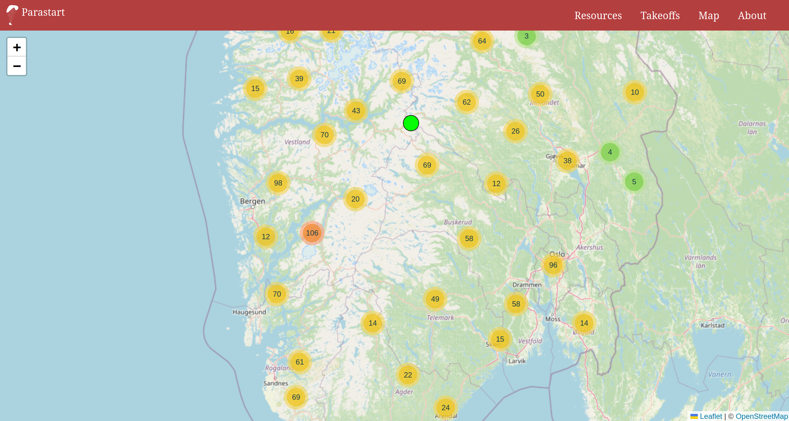
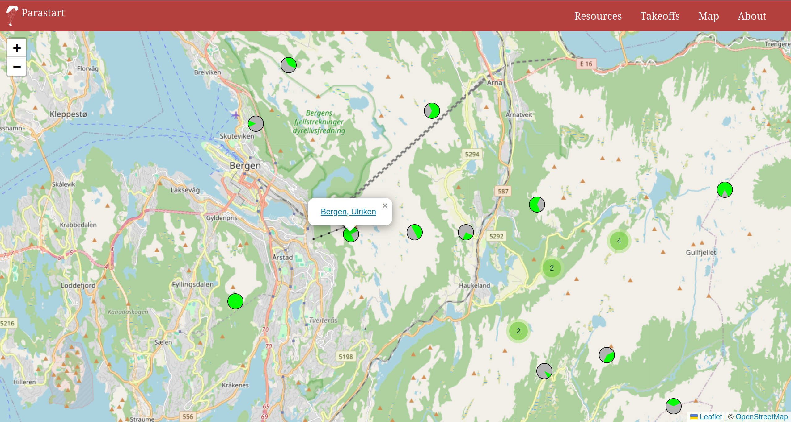
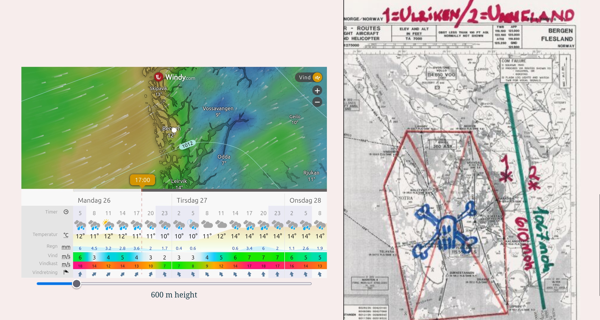
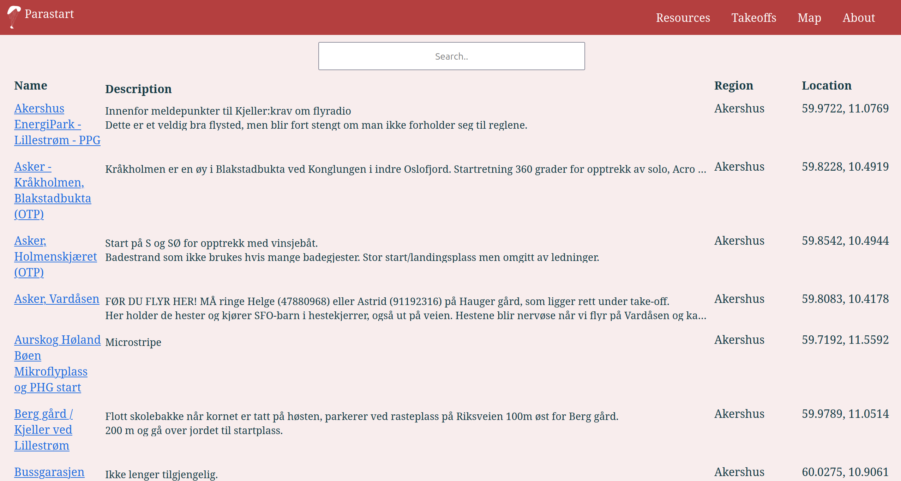

<picture>
<source width='150px' srcset='media/logo/vector/isolated-monochrome-white.svg' media='(prefers-color-scheme: dark)' alt="Parstart">

</picture>
  

## About

An overview of paragliding takeoffs, relevant weather websites, etc. 

# Screenshots

    
    
    
    
    

## Contributing

Feel free to contribute!

Use tools such as [Rustfmt](https://github.com/rust-lang/rustfmt) and [Clippy](https://github.com/rust-lang/rust-clippy) to improve your code.  
Commit messages should be structured like this: `<type>: <description>`.  
Where type is one of the following: `feat`, `fix`, `docs` or `refactor`.

## Resources

* [https://flightlog.org](https://flightlog.org)
* [https://www.paraglidingmap.com](https://www.paraglidingmap.com/app)
* [https://www.paraglidingearth.com](https://www.paraglidingearth.com)
* [https://www.windy.com](https://www.windy.com)
* [https://holfuy.com](https://holfuy.com)
* [https://vindnå.no/](https://vindnå.no/)
